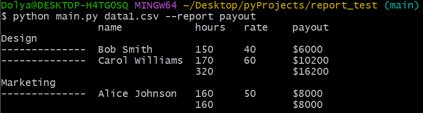
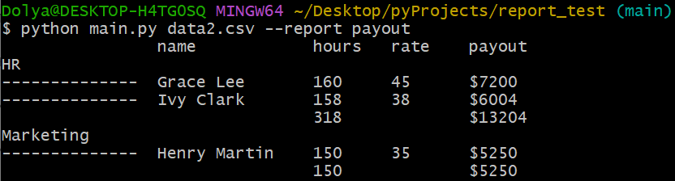
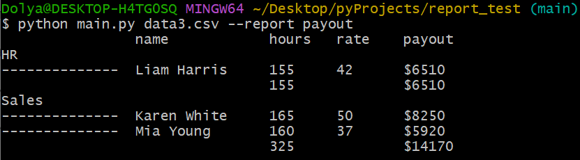
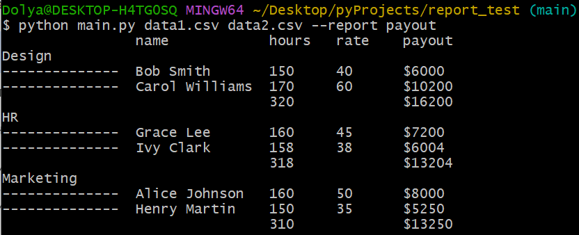
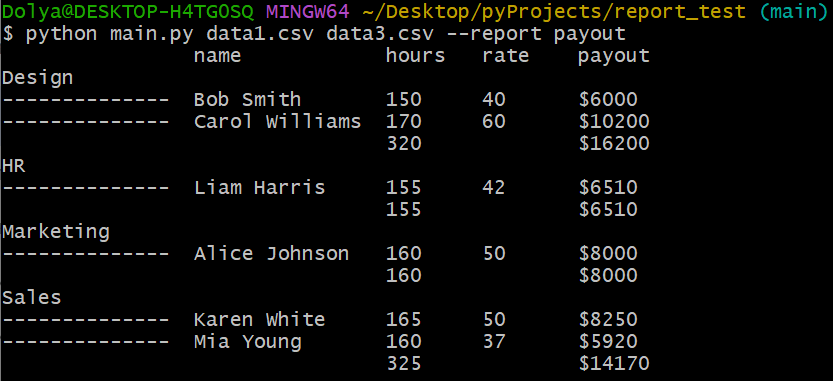
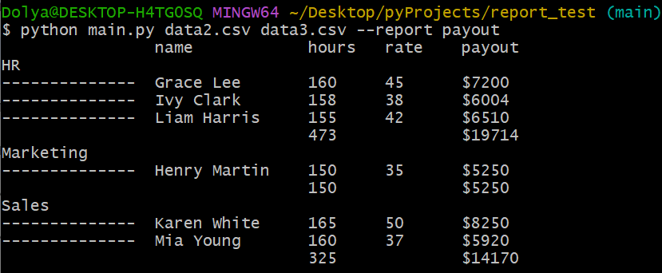
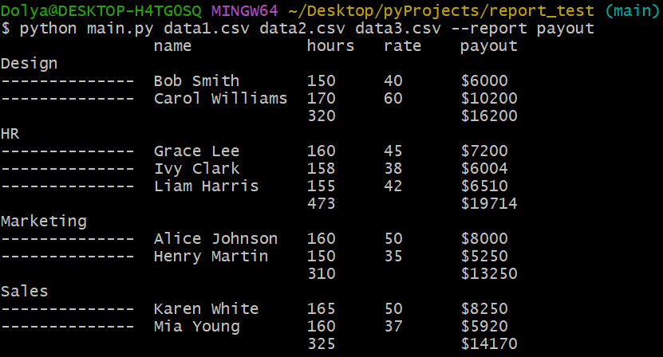
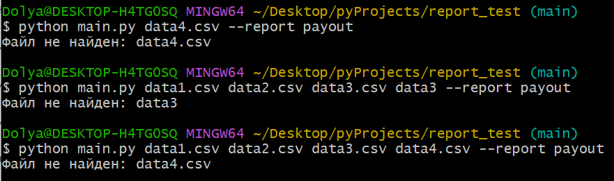

# Скрипт подсчёта зарплаты сотрудников

## Установка

Python 3.7+ должен быть установлен.
```bash
git clone https://github.com/yourusername/payroll-reporter.git
cd payroll-reporter
python -m venv venv
source venv/bin/activate  # для Windows: venv\Scripts\activate
pip install -r requirements.txt  # пока не нужен, если только stdlib
```

## Использование
```bash
python main.py data1.csv data2.csv --report payout
```

## Тесты
```bash
pytest
```

## Структура проекта
```bash
├── main.py               # основной скрипт
├── tests/
│   └── test_main.py      # тесты на Pytest
└── README.md             # этот файл
```

## Скриншоты:
### Отправка одного файла:



### Отправка двух файлов:



### Отправка трех файлов:

### Отправка ошибочных файлов:
